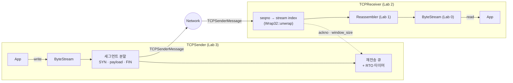

# CS144 Minnow — C++로 구현한 TCP 프로토콜 스택

Stanford [CS144 (Computer Networking)](https://cs144.stanford.edu) 과제를 기반으로, **신뢰할 수 없는 네트워크 위에서 신뢰성 있는 바이트 스트림을 제공하는 TCP의 핵심 구성 요소**를 C++20으로 직접 구현한 프로젝트입니다.
커널 TCP에 의존하지 않고, 순서가 뒤바뀌거나 중복·유실되는 세그먼트를 재조립하는 수신기와 슬라이딩 윈도우·재전송 타이머·흐름 제어를 갖춘 송신기를 구현했습니다.

| | |
|---|---|
| **기간** | 2025.07.03 ~ 2025.07.11 |
| **구현 컴포넌트** | ByteStream · Reassembler · Wrap32 · TCPReceiver · TCPSender · webget |
| **기술** | C++20, CMake, clang-format / clang-tidy, ASan·UBSan 빌드 (`-Werror`) |
| **직접 작성한 코드** | `src/` 5개 모듈 + `apps/webget.cc` (강의 제공 골격 대비 약 390줄) |

---

## Architecture



## 구현 내용

| Lab | 컴포넌트 | 핵심 구현 | 코드 |
|---|---|---|---|
| 0 | webget | TCP 소켓으로 HTTP/1.1 GET 요청을 보내고 EOF까지 응답을 읽는 클라이언트 | [`apps/webget.cc`](apps/webget.cc) |
| 0 | ByteStream | 용량 제한이 있는 바이트 스트림 (Writer / Reader 인터페이스), 누적 push·pop 카운터로 흐름 제어 정보 제공 | [`src/byte_stream.cc`](src/byte_stream.cc) |
| 1 | Reassembler | 순서가 뒤섞이고 서로 겹치는 부분 문자열을 병합 저장한 뒤, 연속된 구간만 스트림에 기록. 수용 용량 밖의 바이트는 폐기 | [`src/reassembler.cc`](src/reassembler.cc) |
| 2 | Wrap32 | 32비트 순환 시퀀스 번호 ↔ 64비트 절대 시퀀스 번호 변환 | [`src/wrapping_integers.cc`](src/wrapping_integers.cc) |
| 2 | TCPReceiver | ISN 기록, seqno → stream index 변환, SYN·FIN을 반영한 ackno 계산, 수신 윈도우 광고, RST 처리 | [`src/tcp_receiver.cc`](src/tcp_receiver.cc) |
| 3 | TCPSender | 수신 윈도우 안에서 `MAX_PAYLOAD_SIZE` 단위로 세그먼트 분할, SYN·FIN 피기백, 재전송 큐, 지수 백오프 RTO 타이머, zero-window probe, RST | [`src/tcp_sender.cc`](src/tcp_sender.cc) |

## 주요 설계

### Reassembler — 겹치지 않는 청크 불변식
- `std::map<uint64_t, std::string>`(시작 인덱스 → 바이트)에 저장하되, **삽입 시점에 겹치는 청크를 모두 하나로 병합**해 저장된 청크끼리는 절대 겹치지 않도록 유지합니다. 덕분에 대기 중인 바이트 수는 청크 크기의 단순 합이 되고, 스트림 기록도 `first_unassembled_index`에서 시작하는 청크만 찾으면 됩니다.
- `insert()` 처리 순서: **EOF 위치 기록 → 이미 기록된 앞부분·용량 밖 뒷부분 잘라내기 → 기존 청크와 병합 → 연속된 청크를 스트림에 push → EOF 도달 시 close**
- 겹침은 아래 다섯 가지 경우로 나눠 처리합니다.

  | 경우 | 처리 |
  |---|---|
  | 새 데이터가 기존 청크를 완전히 포함 | 기존 청크 삭제 |
  | 기존 청크가 새 데이터를 완전히 포함 | 기존 청크 내용 유지 |
  | 기존 청크가 왼쪽에서 겹침 | `청크 앞부분 + 새 데이터` |
  | 기존 청크가 오른쪽에서 겹침 (시작 인덱스가 같은 경우 포함) | `새 데이터 + 청크 뒷부분` |
  | 겹치지 않음 | 그대로 둠 |

### Wrap32 — 가장 가까운 절대 시퀀스 번호 찾기
- `checkpoint`의 상위 32비트(`base`)에 ISN 기준 상대 오프셋을 더한 값과, 그 값의 ±2³² 후보 중 `checkpoint`와 가장 가까운 값을 고릅니다. `base`가 0일 때 −2³² 후보가 언더플로하지 않도록 따로 확인합니다.
- TCPReceiver는 다음에 기대하는 절대 시퀀스 번호(`bytes_pushed() + 1`)를 checkpoint로 사용합니다.

### TCPSender — 재전송 큐와 타이머 분리
- 전송했지만 ACK되지 않은 세그먼트를 `std::deque`에 전송 순서대로 보관하고, ACK가 세그먼트의 **끝**에 도달했을 때(세그먼트 전체가 ACK됐을 때)만 제거합니다.
- RTO 로직을 `Timer` 클래스(`start / stop / tick / expired / double_timeout / reset_timeout`)로 분리해 `push`, `receive`, `tick`이 타이머 내부 상태를 직접 다루지 않게 했습니다.
- 새 데이터가 ACK되면 RTO를 초기값으로 되돌리고 연속 재전송 횟수를 0으로 초기화하며, 남은 세그먼트가 없으면 타이머를 멈춥니다. 타이머가 만료되면 가장 오래된 세그먼트만 재전송합니다.

---

## Troubleshooting

### 1. Reassembler — 겹치는 조각 병합 중 반복자 무효화와 바이트 유실
관련 커밋: [`c834cfb`](https://github.com/hiidy/cs144-lab/commit/c834cfb) → [`0e2797f`](https://github.com/hiidy/cs144-lab/commit/0e2797f) → [`eaaa67a`](https://github.com/hiidy/cs144-lab/commit/eaaa67a) → [`80b269a`](https://github.com/hiidy/cs144-lab/commit/80b269a)

**문제와 원인**
- **반복자 무효화**: `for (...; ++it)` 루프 안에서 `it = erase(it)`를 쓰고 있어, 지운 다음 원소를 `++it`로 건너뛰거나 `end()`를 증가시키는 미정의 동작이 생길 수 있었습니다. 겹침 판정도 독립된 `if` 두 개라 이미 지운 청크의 값으로 두 번째 분기가 다시 평가됐습니다.
- **`substr` 범위 초과**: 새 데이터가 이미 기록된 구간이나 기존 청크 안에 완전히 포함되면 잘라낼 길이가 데이터 길이보다 커져 `std::out_of_range`가 발생했습니다.
- **바이트 유실**: 병합 조건을 고치는 중간 단계(`eaaa67a`)에서, 기존 청크와 **시작 인덱스가 같고 더 짧은** 데이터가 어떤 겹침 조건에도 걸리지 않았습니다. 그 결과 `map[first_index] = data`가 더 긴 기존 청크를 덮어써 바이트가 사라졌습니다.
- **EOF 판정 오류**: 마지막 조각의 위치를 잘라내기·병합 *이후*에 기록해서, 용량 때문에 마지막 조각이 잘리면 EOF 위치가 앞당겨져 스트림이 일찍 닫혔습니다. 범위 밖이라 조기 반환되면 EOF가 아예 기록되지 않았습니다.

**해결**
- 증감식을 루프 헤더에서 빼고, 하나의 `if / else if` 체인에서 `erase()`가 돌려준 반복자를 쓰거나 `++it`를 하도록 정리
- 겹침을 위 표의 다섯 가지 경우로 나눠 경계 조건(`<` / `<=`)을 하나씩 검증
- 잘라낼 길이를 `min(first_unassembled_index, first_index + data.size()) - first_index`로 제한
- EOF 위치는 함수 진입 직후 **원본 기준**으로 기록하고, `bytes_pushed() == eof_index_`일 때만 close

### 2. TCPSender — 일부만 ACK된 세그먼트가 재전송 큐에서 사라짐
관련 커밋: [`b33cebe`](https://github.com/hiidy/cs144-lab/commit/b33cebe)

- **문제**: 재전송 큐에서 세그먼트를 빼는 조건이 `세그먼트 시작 <= ackno`였습니다. 그래서 수신측이 세그먼트의 시작 위치를 ACK하기만 해도, 즉 **그 세그먼트를 한 바이트도 받지 못했어도** 큐에서 제거됐습니다. 이 세그먼트가 유실되면 다시는 재전송되지 않습니다.
- **해결**: `세그먼트 시작 + sequence_length() <= ackno`, 즉 세그먼트 전체가 ACK됐을 때만 제거하도록 바꿨습니다. 이때 새 ACK를 받으면 RTO 초기화, 연속 재전송 횟수 초기화, 타이머 재시작·정지 규칙도 함께 정리했습니다.

### 3. TCPSender — FIN 세그먼트의 플래그·seqno 오류
관련 커밋: [`4f03f1c`](https://github.com/hiidy/cs144-lab/commit/4f03f1c), [`b33cebe`](https://github.com/hiidy/cs144-lab/commit/b33cebe), [`8d47b21`](https://github.com/hiidy/cs144-lab/commit/8d47b21)

- **복사-붙여넣기 버그**: SYN 분기를 복사해 FIN 분기를 만들면서 `fin_sent_` 대신 `sync_sent_`를 true로 바꾸고 seqno를 `isn_`으로 설정했습니다. 그 결과 FIN이 ISN(SYN의 seqno)으로 전송됐고, `push()`를 호출할 때마다 다시 전송될 수 있었습니다.
- **값 복사 시점 문제**: 수정 과정에서 세그먼트를 재전송 큐에 `push_back`한 **뒤에** seqno를 설정하는 코드가 생겼습니다. `deque`에는 메시지의 복사본이 저장되므로 큐 안의 FIN은 seqno가 비어 있었고, 재전송 때 잘못된 seqno로 나갔습니다. 그래서 **seqno 확정 → 큐에 저장 → 전송** 순서로 고정했습니다.
- **FIN 공간 계산 순서**: 데이터 세그먼트에 FIN을 실을 수 있는지 판단할 때 payload 길이를 반영하기 전의 `next_seqno_`를 써서, 윈도우가 이미 꽉 찼는데도 FIN을 덧붙였습니다. 데이터 세그먼트에 FIN을 실은 뒤 `fin_sent_`를 세팅하지 않아 FIN이 중복 전송되는 문제도 있었습니다. `next_seqno_`를 먼저 갱신한 뒤 남은 공간을 확인하고 플래그를 세팅하도록 고쳤습니다.

### 4. TCPSender — Zero window에서 양쪽이 서로를 기다리는 문제
관련 커밋: [`8d47b21`](https://github.com/hiidy/cs144-lab/commit/8d47b21), [`b33cebe`](https://github.com/hiidy/cs144-lab/commit/b33cebe)

- **문제**: 수신측이 window 0을 광고하면 송신측은 아무것도 보내지 않습니다. 수신측은 받은 세그먼트가 없으니 버퍼가 비었다는 사실(새 window)을 알릴 계기가 없고, 결국 연결이 멈춥니다.
- **해결**
  - window가 0이면 1로 간주해 **1바이트 probe 세그먼트**를 보내고, 수신측이 그 ACK에 갱신된 window를 실어 보내게 했습니다.
  - zero window에서의 재전송은 네트워크 혼잡 때문이 아니므로 **RTO를 2배로 늘리지 않고 연속 재전송 횟수도 세지 않게** 했습니다. 그렇지 않으면 probe 간격이 기하급수적으로 늘어나고, 최대 재전송 횟수를 넘어 연결이 끊어질 수 있습니다.

### 5. TCPSender — 윈도우를 다 쓰지 못하던 문제
관련 커밋: [`8d47b21`](https://github.com/hiidy/cs144-lab/commit/8d47b21), [`652d762`](https://github.com/hiidy/cs144-lab/commit/652d762)

- `push()`가 `if`로 세그먼트를 하나만 보내서, 윈도우가 `MAX_PAYLOAD_SIZE`보다 커도 세그먼트 한 개만 전송됐습니다. 윈도우가 찰 때까지 `while`로 반복 전송하도록 바꿨습니다.
- 윈도우에 여유가 있어도 SYN 세그먼트에는 데이터를 싣지 않았습니다. SYN이 시퀀스 번호 1개를 차지한다는 점을 반영해 `윈도우 잔량 - 1`만큼 payload를 함께 보내도록 고쳤습니다.

---

## 개선 방향

- **ByteStream `pop()`이 O(n)**: `std::string`의 앞부분을 `erase()`하므로 pop할 때마다 남은 버퍼 전체가 이동합니다. 작은 단위로 자주 읽을수록 느려집니다. → 읽기 오프셋을 두고 나중에 한꺼번에 compaction하거나, 링 버퍼 / `std::deque<std::string>`로 바꾸는 방법이 있습니다.
- **Reassembler 병합이 청크 수에 비례**: `insert()`마다 저장된 모든 청크를 순회하고, 순회 중 청크 문자열을 값으로 복사합니다. → `std::map::lower_bound`로 겹칠 수 있는 범위만 탐색하고, 참조로 접근하도록 개선할 수 있습니다.
- **TCPReceiver의 `const_cast`**: RST를 받으면 `const Writer&`를 `const_cast`해 에러를 설정합니다. `ByteStream::set_error()`는 Reader에서도 호출할 수 있으므로 `reader().set_error()`로 바꾸면 `const_cast` 없이 처리할 수 있습니다.

## 프로젝트 구조

```
src/
├── byte_stream.{hh,cc}        # Lab 0  유한 버퍼 바이트 스트림
├── reassembler.{hh,cc}        # Lab 1  순서 재조립
├── wrapping_integers.{hh,cc}  # Lab 2  32비트 seqno ↔ 64비트 절대 seqno
├── tcp_receiver.{hh,cc}       # Lab 2  TCP 수신기
└── tcp_sender.{hh,cc}         # Lab 3  TCP 송신기 (재전송 타이머 포함)
apps/webget.cc                  # Lab 0  HTTP 클라이언트
tests/  util/  etc/             # 강의 제공 테스트·유틸리티·빌드 설정
docs/                           # 과제 명세 (checkN.pdf)
```

## Build & Test

**Requirements**: Linux, C++20 컴파일러(`std::format` 지원, 예: GCC 13 이상), CMake 3.24.2 이상, clang-format / clang-tidy (선택)

```bash
cmake -S . -B build                      # 빌드 설정
cmake --build build                      # 컴파일
cmake --build build --target check3      # Lab 0 ~ 3 테스트 (ASan·UBSan 빌드)
cmake --build build --target speed       # ByteStream / Reassembler 처리량 측정
cmake --build build --target tidy        # clang-tidy
cmake --build build --target format      # clang-format
```

## Acknowledgements

과제 명세, 테스트, `util/` 및 빌드 설정은 Stanford CS144(Keith Winstein) 강의에서 제공한 코드입니다. 이 저장소에서 직접 작성한 부분은 `src/`의 각 모듈 구현과 `apps/webget.cc`입니다.
